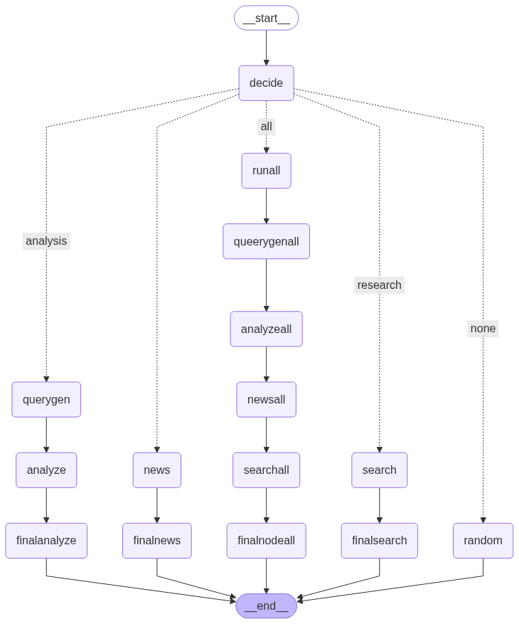

<h1>📈 Bitcoin Price Predictor & Financial Chat Assistant</h1>

This project is an intelligent app that predicts the future price of Bitcoin using deep learning models like <strong>LSTM</strong> and <strong>Facebook Prophet</strong>. It features a real-time chatbot powered by <strong>LangGraph</strong>, giving personalized financial advice and search functionality across a local Bitcoin database and the internet.

<h2>🚀 Features</h2>
<ul>
  <li>🔮 <strong>Bitcoin Price Prediction</strong> using LSTM and Prophet models</li>
  <li>🤖 <strong>AI Chatbot</strong> for financial advice, news, and Bitcoin questions</li>
  <li>🌐 <strong>Web Search Integration</strong> for real-time financial data and news</li>
  <li>📊 <strong>Real-time Bitcoin Graph</strong> using Plotly</li>
  <li>🔁 <strong>LangGraph-powered Workflow</strong> to manage chatbot logic and data search</li>
  <li>🖼️ <strong>Visual LangGraph Structure</strong> shown below</li>
</ul>

<h2>🧠 Technologies Used</h2>
<ul>
  <li><strong>LangGraph</strong> — chatbot logic management</li>
  <li><strong>LangChain</strong> — LLM integration</li>
  <li><strong>LSTM</strong> — time-series deep learning model for price forecasting</li>
  <li><strong>Facebook Prophet</strong> — interpretable time-series forecasting</li>
  <li><strong>Plotly</strong> — real-time charting</li>
  <li><strong>Flask HTML CSS JAVASCRIPT</strong> — frontend interface</li>
  <li><strong>Pandas + Numpy</strong> — data processing</li>
</ul>

<h2>📥 Installation</h2>
<pre><code>git clone https://github.com/yourusername/bitcoin-predictor
cd bitcoin-predictor
pip install -r requirements.txt
</code></pre>

<h2>⚙️ How It Works</h2>
<ol>
  <li>User inputs a question or query about Bitcoin</li>
  <li>LangGraph chatbot decides whether to:
    <ul>
      <li>Search internet</li>
      <li>Query Bitcoin DB</li>
      <li>Fetch financial news</li>
      <li>Run full prediction pipeline</li>
    </ul>
  </li>
  <li>Prediction is done using LSTM + Prophet</li>
  <li>Chatbot responds with a result</li>
  <li>Graph updates in real time</li>
</ol>

<h2>📊 Real-Time Bitcoin Graph</h2>

The GUI shows a live-updating Bitcoin candlestick chart using <strong>Plotly</strong>, updated via WebSocket or polling. It includes:

<ul>
  <li>Price changes</li>
  <li>Prediction overlays</li>
  <li>Volume and RSI indicators (if added)</li>
</ul>

<h2>🔄 LangGraph Workflow</h2>

  

<h2>✅ Future Improvements</h2>
<ul>
  <li>Trading strategy simulations</li>
  <li>Social media sentiment analysis</li>
  <li>Telegram/Discord bot version</li>
</ul>

<h2>📄 License</h2>

This project is open-source under the MIT License.

